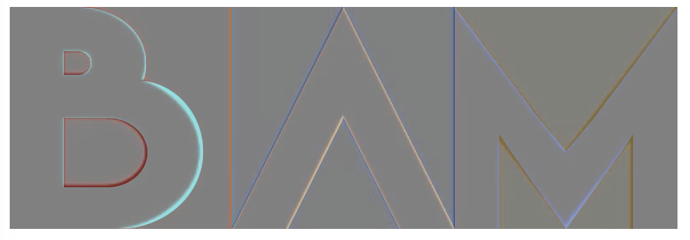

Render: [https://theodo.github.io/signature/](https://theodo.github.io/signature/)

:warning::warning::warning:
Never delete an image that is on this repo. It may be used in an older version of the signature that someone still uses. If you delete it, someone may have its signature broken.
:warning::warning::warning:

# Adding & updating a signature

## Files to edit / add

- `scripts/config.js`
- `signatureTemplates/*.html` that must be minified afterwards to avoid issues in some mail clients (font-size: 0 does not work everywhere).
- Check [CSS support in mail clients](https://www.campaignmonitor.com/css/)

NB: it can be usefull to change the config to point to the unminified template for your tests, but be sure not to commit that.

## About images embeded in signatures

- **no css resizing** because some mail client don't support it and your logo will be very big (yes, your image will be low quality and there is nothing you can do about it). It means that the height/width of the HTML img should be the same as the image itself.
- if possible, **exclude all text from the image** as it will look very bad due to the low resolution. Instead, add the text in the HTML template.
- **svg and embeded images (base64) do not work** everywhere (so do not use them)
- **background images do not work** everywhere
- you most likely want to **use png images with a transparent background** (on mac os, there is now a dark theme that can make your signature look bad if it has a white background)
- to avoid playing with margins, be sure to **use images whithout margins**

## Minify signature templates

- `npm install html-minifier-cli -g`
- `./minimizeSignatures.sh`

## Definition of done

**BEWARE**
Modifying the signature's style is very tricky.
Indeed, the various mail clients modify the signature's style...
You need to check that the signature renders correcty when received on:

- Gmail
- Outlook 2013+ :warning: most of your problems will come from old versions of Outlook which are still widely used

# Make a signature editable with the form

In the signature template, use the following classes and ids (this needs clean up)

- class `signatureName`
- class `signatureJob`
- class `signatureMail`
- class `signatureFrTel`
- id `signatureUkTel`
- id `signatureMaTel`
- id `frenchAddress`
- id `ukAddress`
- See how to handle several phones with id `signatureFrTelGroup`, `signatureUkTelGroup`, and `signatureMaTelGroup` in the code
- Same with addresses

# About CSS logos

I don't recommend doing a CSS logo, but I did it for BAM (after many struggles) and here's what I learned

- relative and absolute positioning don't work
- negative margins don't work
- empty divs are not rendered in all mail clients (thanks Outlook 2013) but when it does, `overflow: hidden` also does. See how to use a text backup in BAM's signature. ;)

You can compare the rendering of your CSS with the image of the logo this way:

- Put your logo in a div with position relative
- Add an img of the real logo with the following style `style="position: absolute; top: 0; width: 100%; height: 100%; left: 0; opacity: 0.5; filter: invert()"`
- Every difference between your CSS and the true logo will not be grey.
  Example for BAM:
  
